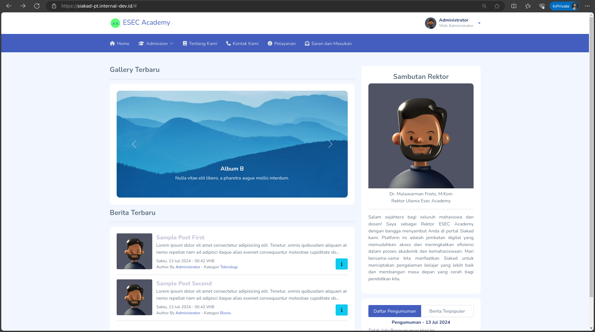
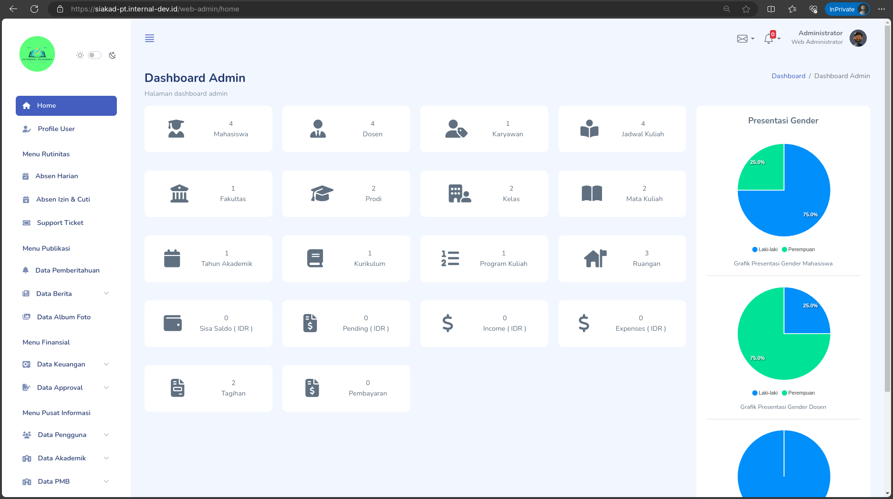

<p align="center"><a href="https://siakad-pt.internal-dev.id" target="_blank"></a></p>

<p align="center">
<a href="CHANGELOG.MD">ESEC Academy - Open Source Project | v0.031b - Changelogs</a>
<br>
<span>Latest Update: 20 Juli 2024</span>
</p>
<p align="center">
<a href="https://github.com/mjaya69703"></a>
<a href="https://facebook.com/kyouma052"></a>
<a href="https://instagram.com/mjaya69703"></a>
<a href="mailto:jaya.kusuma@internal-dev.id"></a>
</p>

## Preview Images

<p align="center">Halaman Utama</p>
<hr>

<p align="center">Halaman Admin / Backend</p>

## About Project
Proyek Sistem Informasi Akademik (SIAKAD) ini bertujuan untuk menyediakan platform digital yang komprehensif dan efisien bagi perguruan tinggi dalam mengelola data akademik dan administratif. yang dibangun dengan Menggunakan framework Laravel 11, proyek ini dirancang untuk memenuhi kebutuhan modern dari proses pendidikan tinggi, dari manajemen mahasiswa dan staf pengajar hingga pengelolaan kurikulum dan penjadwalan.

## Feature List

Pada proyek SiakadPT, terdapat 5 tingkat akses kontrol yang diperuntukkan bagi admin, 2 untuk dosen, dan 2 untuk mahasiswa. Namun, seiring dengan perkembangan proyek ini, diperkirakan jumlah akses kontrol akan terus bertambah seiring dengan peningkatan fitur dan kebutuhan pengguna. Hal ini menunjukkan fleksibilitas dan skalabilitas sistem yang dirancang untuk dapat menyesuaikan diri dengan tuntutan dan perubahan dalam lingkungan pendidikan tinggi secara efektif. 

Berikut kami informasikan Fitur Utama SiakadPT yang kami bangun.

<b>Fitur Untuk Staff / Karyawan ( Dibagi Sesuai Departemen )</b>
1. Dashboard Admin
2. Kelola Profile ( Edit Data Pribadi &  Ubah Password)
3. Menu Rutinitas
    - Absen Harian
    - Absen Izin / Cuti
    - Support Ticket ( Pelayanan Online / Daring )
4. Menu Publikasi
    - Pengumuman
    - Publikasi Berita ( Post dan Kategori )
    - Publikasi Album Foto / Gallery
5. Menu Finansial
    - Data Keuangan ( Tagihan Secara Online, Pembayaran dan Data Keuangan )
    - Data Approval ( Approval Absensi )
6. Menu Pusat Informasi
    - Data Pengguna ( Staff, Dosen dan Mahasiswa)
    - Data Akademik ( Tahun Akademik, Fakultas dan Program Studi )
    - Data PMB ( Data Program Kuliah )
    - Data KBM ( Kurikulum, Kelas, Mata Kuliah dan Jadwal Kuliah )
    - Data Inventaris ( Gedung dan Ruangan )
7. Pengaturan Website

<b>Fitur Untuk Dosen</b>
1. Dashboard Mahasiswa
2. Kelola Profile ( Edit Data Pribadi &  Ubah Password) 
3. Menu Akademik
    - Lihat Jadwal Perkuliahan ( Lihat Jadwal, Lihat Absen dan Lihat FeedBack )
    - Kelola Tugas Perkuliahan ( Kelola Tugas, Lihat Tugas Mahasiswa, Beri Skor Nilai)

<b>Fitur Untuk Mahasiswa</b>
1. Dashboard Mahasiswa
2. Kelola Profile ( Edit Data Pribadi &  Ubah Password) 
3. Menu Akademik
    - Lihat Jadwal Kuliah ( Absen Per Matakuliah & Beri FeedBack pada Dosen )
    - Lihat Tugas Kuliah ( Lihat Tugas & Pengumpulan Tugas Secara Online )
4. Menu Finansial
    - Data Tagihan ( Lihat Tagihan Aktif, Histori Tagihan dan Pembayaran Secara Online )
5. Menu Bantuan
    - Ticket Support ( Lihat dan Buka Tiket )

<b>Fitur pada Halaman Utama</b>
1. Lihat Publikasi Kata Sambutan, Gallery, Pengumuman, dan Berita / Blog.
2. Kotak Saran & Masukan

## Demo Page
Kamu boleh mencoba fitur apapun pada fitur ini, Apabila kamu memiliki kritik atau saran kamu bisa mengisi pada homepage dibagian menu Kritik dan Saran yang terhubung langsung dengan email pribadi saya.

```
Link : https://siakad-pt.internal-dev.id

Demo with User Account:
Link : https://siakad-pt.internal-dev.id/admin/auth-signin
1. Departement Web Administrator ( Super Admin )
User : admin
Pass : Admin123

2. Departement Admin ( Admin Staff )
User : admin2
Pass : Admin123

3. Departement Finance ( Finance Staff )
User : finance
Pass : Admin123

4. Departement Academic ( Academic Staff )
User : academic
Pass : Admin123

5. Departement Officer ( Officer Staff )
User : officer
Pass : Admin123

6. Departement Support ( Support Staff )
User : officer
Pass : Admin123

Demo with Dosen Account:
Link : https://siakad-pt.internal-dev.id/dosen/auth-signin
User : dosen.a@example.com // You can replace "a" with another alphabet to "d"
Pass : Dosen123

Demo with Mahasiswa Account:
Link : https://siakad-pt.internal-dev.id/mahasiswa/auth-signin
User : mahasiswa.a@example.com // You can replace "a" with another alphabet to "d"
Pass : Mahasiswa123
```

Notes:
1. Dilarang Melakukan Scan QRIS Pada Menu Pembayaran Mahasiswa

## How to Install

1. Persyaratan Software

    A. Khusus Windows

    - Sudah Menginstall Composer
    - Sudah Menginstall WAMP Stack ( Rekomendasi Laragon )

    B. Khusus Linux

    - Sudah Menginstall Git / GitBash
    - Sudah Menginstall Composer
    - Sudah Menginstall PHP 8.2 atau diatasnya
    - Sudah Menginstall MySQL atau MariaDB
    - Sudah Menginstall WebServer Nginx or apache

    C. Khusus Docker

    - Sudah Menginstall Docker

2. Clone Repository

```
git clone https://github.com/mjaya69703/siakad-pt.internal-dev.id.git
cd siakad-pt.internal-dev.id

// Apabila Menggunakan Windows
setup.bash

// Apabila Menggunakan Linux
chmod +x setup.sh
./setup.sh

// Apabila Menggunakan Docker
chmod +x docker.sh
./docker.sh
```

3. Edit File Environment ( .env )

-   Sesuaikan Database Kamu ( For Windows and Linux Installation)

```
DB_PORT=3306
DB_DATABASE=laravel
DB_USERNAME=root
DB_PASSWORD=
```

-   Sesuaikan Konfigurasi Email ( .env )

```
# BILA MENGGUNAKAN BREVO
MAIL_DRIVER=smtp
MAIL_HOST="smtp-relay.brevo.com"
MAIL_PORT=587
MAIL_USERNAME="your@email.xyz"
MAIL_PASSWORD="yourpassword"
MAIL_ENCRYPTION=tls
MAIL_FROM_ADDRESS="${MAIL_USERNAME}"
MAIL_FROM_NAME="${APP_NAME}"
```

-   Sesuaikan Konfigurasi MidTrans ( .env )

```
MIDTRANS_CLIENT_KEY=SB-Mid-client-xxxx   ##   => Input your MidTrans clientKey
MIDTRANS_SERVER_KEY=SB-Mid-server-xxxx   ##   => Input your MidTrans serverKey
MIDTRANS_IS_PRODUCTION=false             ##   => false or true => Choose your condition
MIDTRANS_IS_SANITIZED=true
MIDTRANS_IS_3DS=true
```

-   Addons Cloudflare Turnstile Capctha ( Opsional )

```
1. Change This File In .env
TURNSTILE_SITE_KEY=2x00000000000000000000AB                 ## TURNSTILE SITE KEY
TURNSTILE_SECRET_KEY=2x0000000000000000000000000000000AA    ## TURNSTILE SECRET KEY

2. Enable This Script In
a. app/Http/Controllers/Admin/AuthController/ In Function AuthSignInPost
b. app/Http/Controllers/Dosen/AuthController/ In Function AuthSignInPost
c. app/Http/Controllers/Mahasiswa/AuthController/ In Function AuthSignInPost

'cf-turnstile-response' => ['required', new TurnstileCheck()],  // ENABLE THIS IF YOU WANT USE TURNSTILE
```

4. Menjalankan Project

```
php artisan serve
```

## SHORTCUT

```
For Windows ( Execute In Terminal )
- Run Migrate Refresh Seed
seed.bat
- Run Clear Cache
clear.bat
- Run Installer Windows
setup.bat

For Linux ( Execute In Terminal )
- Run Migrate Refresh Seed
seed.bat
- Run Clear Cache
clear.bat
- Run Installer Linux
setup.bat

For Docker
- Run Installer Docker
docker.bat
```

## CREDITS

-   Framework PHP Laravel <a href="https://laravel.com">Laravel 11</a>
-   Themes Authentication <a href="https://www.creative-tim.com/product/argon-dashboard">Argon Dashboard 2 By Creative Tim</a>
-   Themes BackEnd <a href="https://github.com/zuramai/mazer">Mazer Dashboard By zuramai</a>
-   Dockerize Script <a href="https://github.com/refactorian/laravel-docker">Laravel Docker</a>
